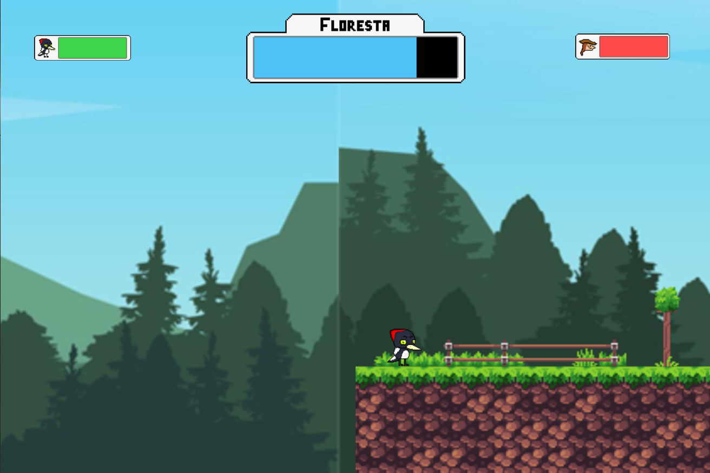
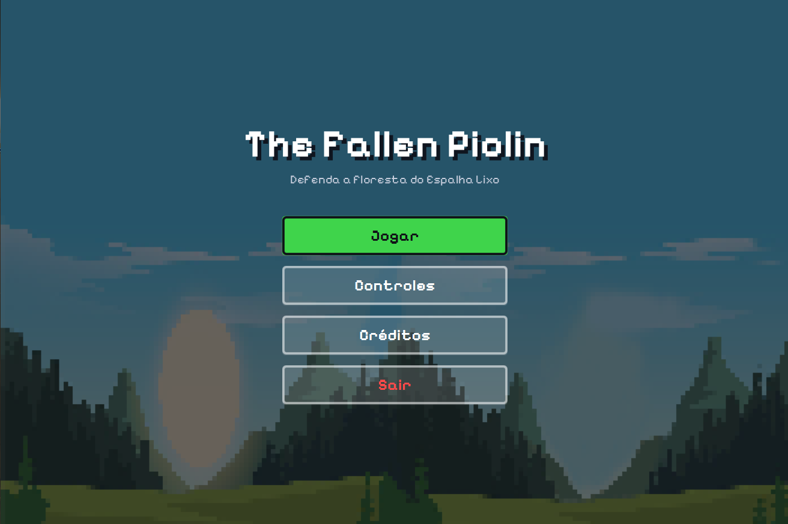
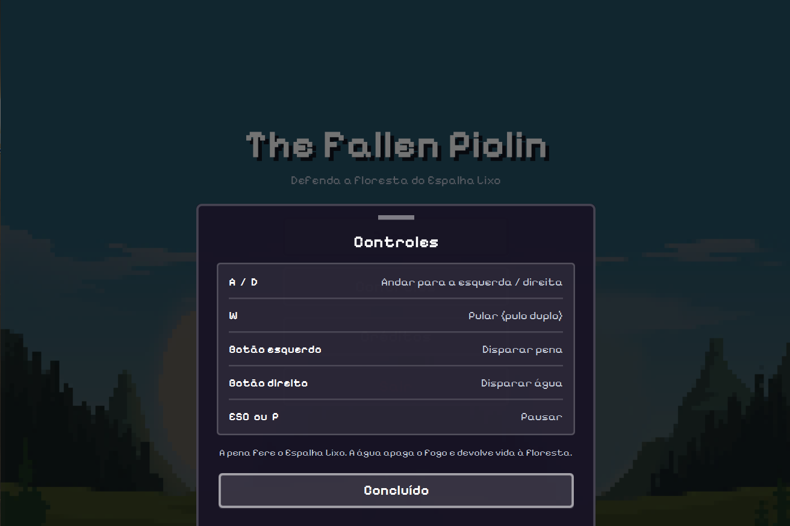
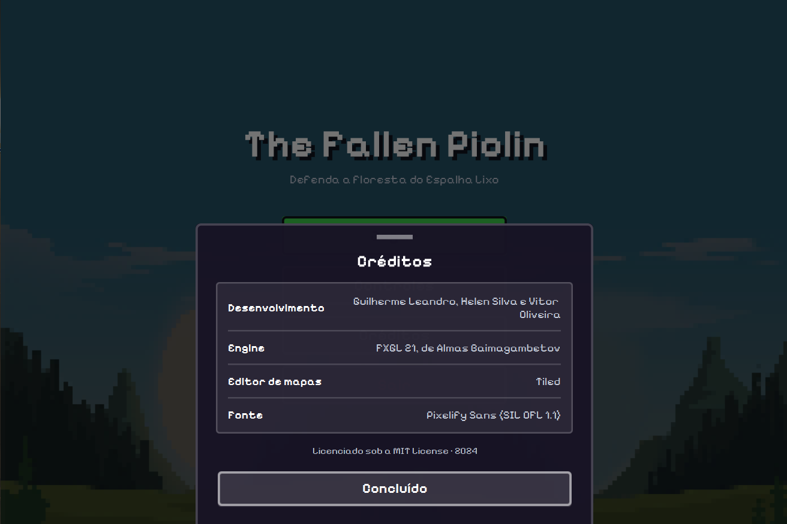
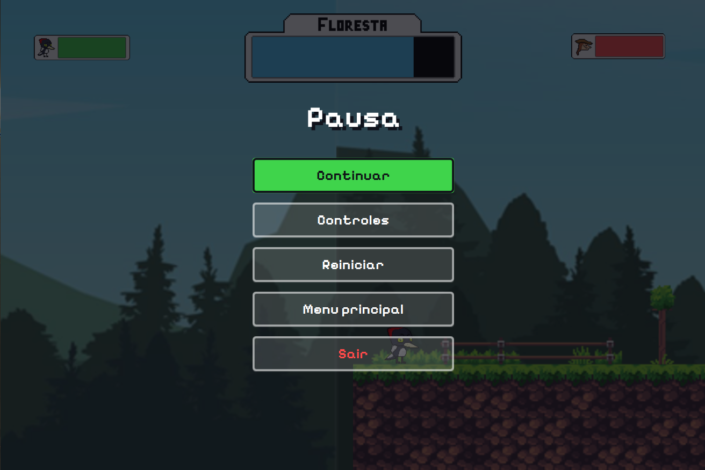
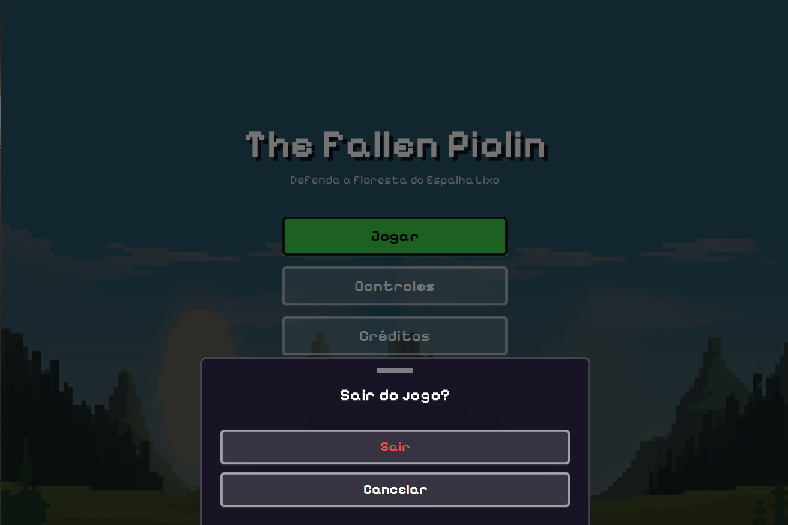
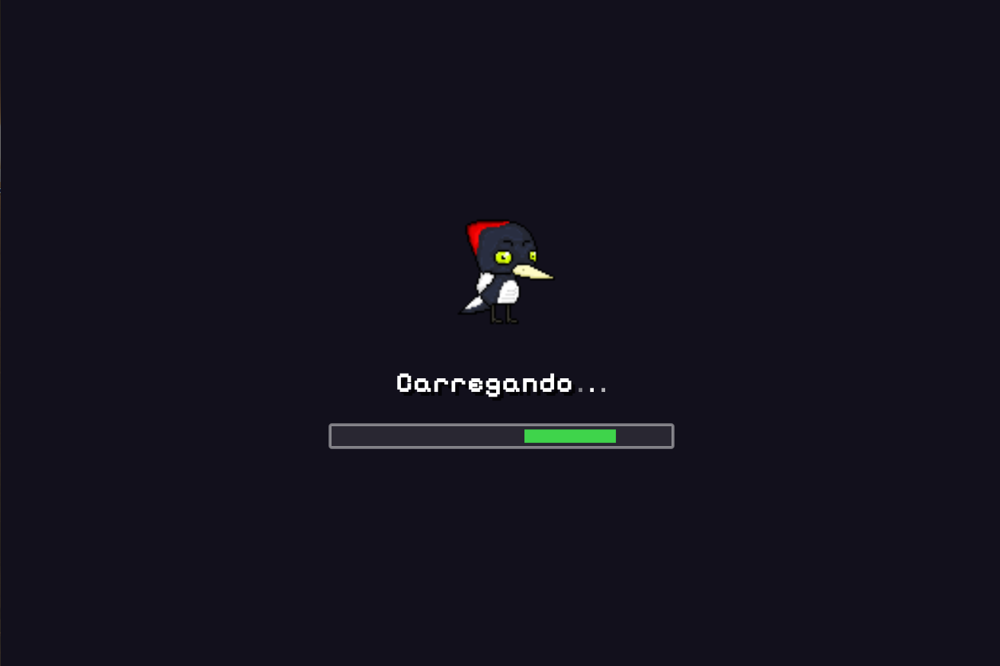
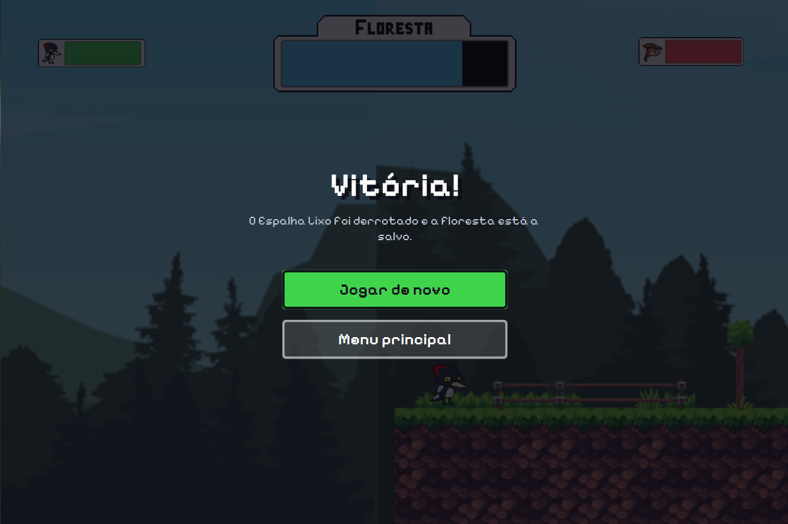
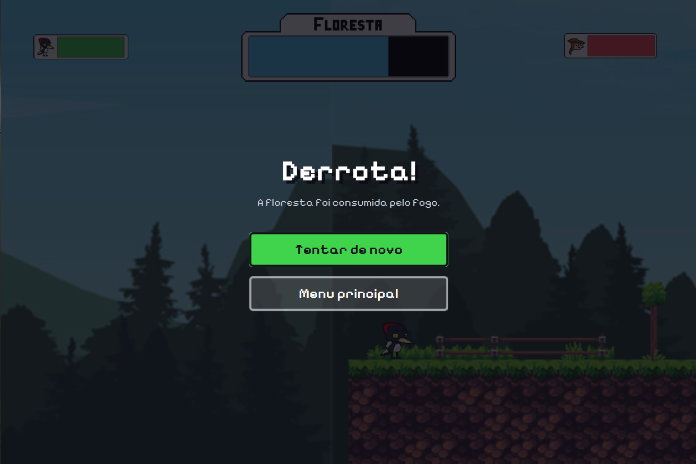

# The Fallen Piolin

Jogo de plataforma 2D com luta de chefe, desenvolvido em **Java 17** com a engine
**[FXGL 21](https://github.com/AlmasB/FXGL)**.

Piolin enfrenta o **Espalha Lixo** enquanto tenta manter a floresta de pé: o inimigo
incendeia os objetos combustíveis espalhados pelo mapa, e cada objeto em chamas
consome a vida da floresta.



## Tela de início



Ao abrir, o jogo mostra um menu principal que junta duas referências: **a arrumação
vem do iOS e a aparência vem do pixel art**.

Do iOS vem só o arranjo dos elementos — uma coluna central de ações, cartões agrupados
com o rótulo à esquerda e o valor à direita, folhas que sobem pela base da tela e muito
respiro entre os itens. **Controles** e **Créditos** abrem essas folhas, fechadas pelo
botão Concluído ou por um clique fora delas.

Tudo o que é visual segue a arte do jogo: fonte pixelada, cantos quase retos, bordas
grossas e sombras duras. O papel de parede é a própria arte da floresta reduzida a
blocos (o desfoque seria o oposto de pixel art) e escurecida para os botões ficarem
legíveis.

| Controles | Créditos |
|---|---|
|  |  |

## Menu de pausa



`ESC` ou `P` durante a partida abrem o menu de pausa, no mesmo estilo da tela de
início: **Continuar**, **Controles**, **Reiniciar**, **Menu principal** e **Sair**. Em
vez de papel de parede ele usa só uma camada escura translúcida, para o jogador
continuar vendo a partida pausada atrás.

As confirmações de sair do jogo e de voltar ao menu também são nossas — o diálogo
padrão do FXGL usava as cores e o acabamento da engine. Por isso as telas chamam
`PaineisDoMenu.confirmarSaida(...)` em vez de `fireExit()`.



As fontes da própria engine (`setFontUI`, `setFontGame`, `setFontText`, `setFontMono`
em `Main.initSettings`) também apontam para a Pixelify Sans, então qualquer tela que o
FXGL desenhe por conta própria continua com a fonte pixelada.

## Tela de carregamento

Aparece entre o menu e a partida, com o Piolin pulando, "Carregando..." e uma barra
indeterminada. Ela é rápida — costuma durar menos de um quarto de segundo. A tela de
inicialização do FXGL, mostrada ao abrir o jogo, usa exatamente o mesmo visual.



O Piolin **pula em vez de girar**, como fazia antes: rotacionar um sprite obriga o
JavaFX a interpolar as cores e desmancha a grade de pixels, enquanto um deslocamento
vertical preserva cada pixel intacto. Pelo mesmo motivo o sprite é ampliado por um
fator inteiro (2×), para cada pixel da arte virar um quadrado exato.

## Onde mexer no visual

O estilo fica todo em `ui/menu/EstiloDaInterface.java` — cores, cantos, espessuras e
fontes estão centralizados ali, então dá para mudar a aparência de toda a interface
(os dois menus, as folhas e o carregamento) editando um arquivo só. O tamanho dos
blocos do papel de parede é a constante `TAMANHO_DO_BLOCO` em
`ui/menu/MenuPrincipal.java`.

## Como jogar

| Barra | Significado |
|---|---|
| Verde (esquerda) | Vida do Piolin |
| Azul (centro) | Vida da floresta |
| Vermelha (direita) | Vida do Espalha Lixo |

- **Vitória**: zerar a vida do Espalha Lixo.
- **Derrota**: zerar a vida do Piolin **ou** a da floresta.

A pena machuca o inimigo; a água apaga o fogo dos objetos combustíveis e devolve
vida à floresta. Há um tempo de espera de 600 ms entre disparos, compartilhado
pelas duas armas.

## Fim de partida

O desfecho ocupa o centro da tela, com a mesma arrumação dos menus. A derrota informa
o motivo — o Piolin caiu ou a floresta queimou —, já que as duas causas levam à mesma
tela.

| Vitória | Derrota |
|---|---|
|  |  |

## O Espalha Lixo

Ele tem uma intenção: **atear fogo**. Caminha até o objeto combustível mais próximo
que ainda não está queimando, chega perto e o incendeia. Só larga esse plano quando o
Piolin se aproxima, e por pouco tempo — depois volta a circular pelo mapa.

| Estado | Quando | O que faz |
|---|---|---|
| `INCENDIANDO` | Padrão | Vai até o combustível apagado mais próximo e ateia fogo |
| `DEFENDENDO` | Piolin por perto | Mantém distância dele e atira, por no máximo 2,5s |
| `CACANDO` | Nada apagado ao alcance | Persegue o Piolin |

Abaixo de 1/3 de vida ele **se enfurece**: anda mais rápido, atira com menos espera e
a animação de caminhada acelera, para a mudança ficar visível.

O cérebro é `IaDoEspalhaLixo` e o corpo é `EnemyComponent` — um decide, o outro
executa. As constantes de balanceamento estão no topo dessas duas classes: distância
de ameaça, alcance de tiro, tempo de preparo e as esperas entre disparos.

## Controles

| Tecla | Ação |
|---|---|
| `A` / `D` | Andar para a esquerda / direita |
| `W` | Pular (pulo duplo) |
| Botão esquerdo do mouse | Disparar pena |
| Botão direito do mouse | Disparar água |
| `ESC` ou `P` | Menu de pausa |

Atalhos de teste (`J`, `L`, `I`, que movem e fazem o inimigo atirar) só existem
quando `MODO_DA_APLICACAO` em `Main.java` é diferente de `ApplicationMode.RELEASE`.

## Rodando o projeto

Requer **JDK 17 ou superior** e **Maven**. A partir da pasta `Game/`:

```bash
mvn javafx:run
```

Rodar os testes:

```bash
mvn test
```

Gerar um JAR executável com todas as dependências em `Game/target/`:

```bash
mvn package
```

## Estrutura

```
Game/
  pom.xml
  src/main/java/org/example/
    Main.java                       Ciclo de vida, entradas, física e colisões
    MainFactory.java                Fábrica de todas as entidades (@Spawns)
    MainLoadingScene.java           Tela de carregamento
    EntityType.java                 Tipos de entidade usados nas colisões
    PlayerComponent.java            Piolin: animação, movimento, disparos, vida
    EnemyComponent.java             Espalha Lixo: corpo (visual, movimento, vida)
    IaDoEspalhaLixo.java            Cerebro do inimigo: decide o que ele faz
    ObjetoCombustivelComponent.java Objetos que pegam fogo no mapa
    Floresta.java                   Vida coletiva da floresta
    ui/Hud.java                     Dono das barras de vida em tela
    ui/BarraDeVida.java             Barra: moldura + preenchimento
    ui/menu/MenuComEstilo.java      Base comum aos dois menus
    ui/menu/MenuPrincipal.java      Tela de início (menu principal)
    ui/menu/MenuDePausa.java        Menu de pausa (ESC ou P)
    ui/menu/EstiloDaInterface.java  Cores, fontes e botões de toda a interface
    ui/menu/PainelDeslizante.java   Folha inferior: listas e confirmações
    ui/menu/PaineisDoMenu.java      Conteúdo das folhas, usado pelos dois menus
    utilitarios/Vida.java           Regra de vida pura (testável)
    utilitarios/FimDeJogo.java      Telas de vitória e derrota
  src/main/resources/assets/        Texturas, sons, música e mapa Tiled
  src/test/java/                    Testes das regras puras
Models/                             Arquivos-fonte de arte (Aseprite e PNGs)
```

### Notas de arquitetura

- **Nada de estado `static` entre partidas.** `Hud`, `Floresta` e `MainFactory` são
  recriados a cada `initGame()`, e a interface é limpa com `clearUINodes()`. Um
  reinício começa sempre do zero.
- **As barras de vida são derivadas de `Vida`**, nunca atualizadas em paralelo. Isso
  impede que a barra saia de sincronia com a vida real.
- **`Vida` não depende do FXGL nem do JavaFX**, então as regras de dano e cura podem
  ser testadas sem subir o motor do jogo.

## Mapa

O nível é editado no **[Tiled](https://www.mapeditor.org/)**, em
`src/main/resources/assets/levels/tmx/map-remastered8.tmx`. Os objetos do mapa usam
o campo `type` para escolher o método `@Spawns` correspondente na `MainFactory`:
`platform`, `poligono`, `objetoCombustivel` e `parede_limite_do_mapa`.

## Licença

O código é licenciado sob a MIT License — ver [LICENSE](LICENSE).

A fonte do menu é a **Pixelify Sans**, © 2021 The Pixelify Sans Project Authors
([repositório](https://github.com/eifetx/Pixelify-Sans)), distribuída sob a
[SIL Open Font License 1.1](Game/src/main/resources/assets/ui/fonts/OFL.txt). O texto
completo da licença acompanha os arquivos em `assets/ui/fonts/`.
